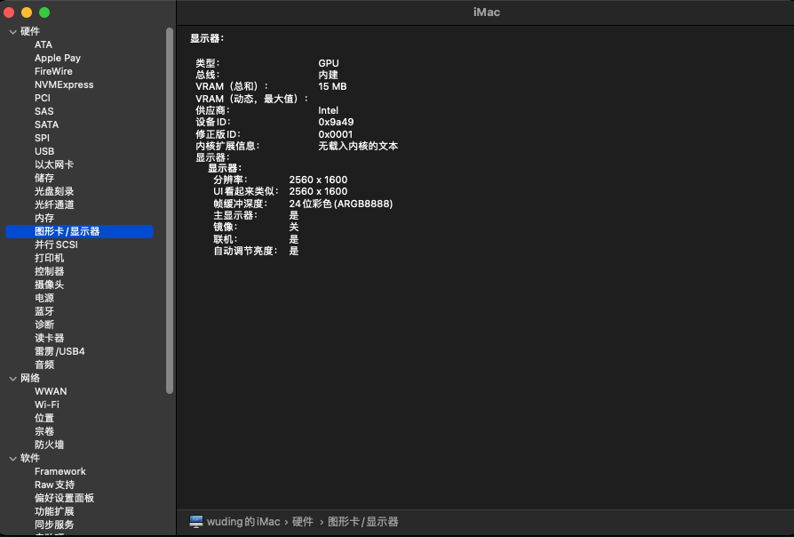

# Lenovo Thinkbook13s G2 ITL Hackintosh

## Current MacOS version

> MacOS Big Sur `11.4`

## Laptop Configuration

| Hardware | info                                                  |
| -------- | ----------------------------------------------------- |
| CPU      | Intel(R) Core(TM) i5-1135 G7 @2.40GHz (Tiger Lake LP) |
| Memory   | DDR4 16GB 2400MHz                                     |
| DISK     | Samsung 512G SSD                                      |
| Graphics | Intel(R) Iris Xe Graphics 630                         |
| Monitor  | IPS 13.3 Max 2560x1600                                |
| Sound    | ACL 257                                               |
| WiFi     | Inel AX201                                            |
| Trackpad | Intel I2C HID INT34BB                                 |

## What doesn't work

| Status | Name        | info                 |
| :----: | ----------- | -------------------- |
|   ❌    | Sleep       |                      |
|   ❌    | Fingerprint | USB custom blocked   |
|   ❌    | Graphics    | QE/QI is unsupported |
|   ❌    | Sound       |                      |

## Boot

> OpenCore 0.6.8

## Some Screenshots

